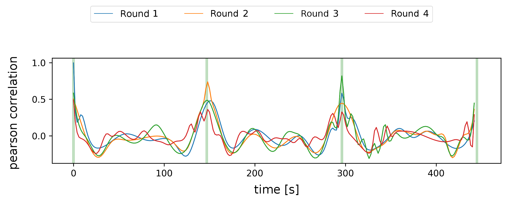
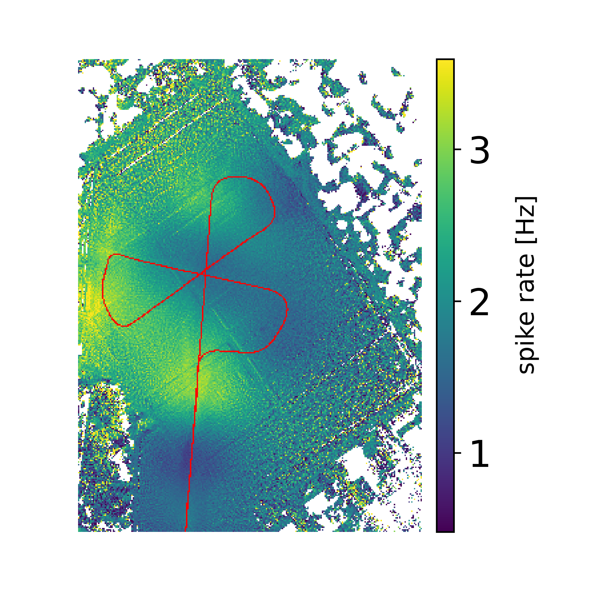
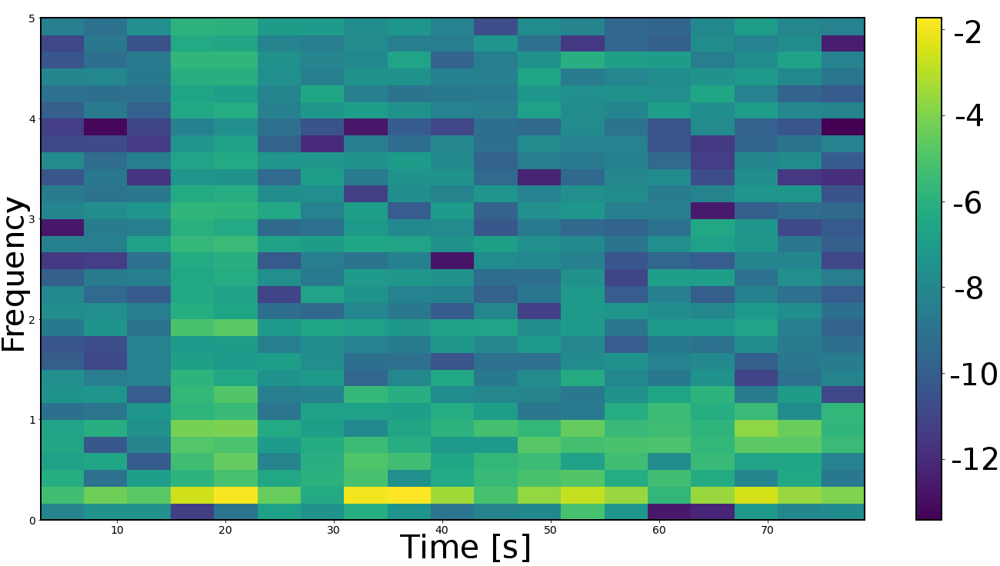

# NeuroCopter-Analysis

The project [NeuroCopter](http://berlinbiorobotics.blog/projects/neurocopter/) of the workgroup [Artificial and Collective Intelligence](http://berlinbiorobotics.blog/)(formerly called Biorobotics lab) at Freie Universität Berlin examines navigational capabilities of honeybees. In Experiments a bee is attached to a quadcopter which records the animal's brain activity while flying. This repository contains the analysis of recorded data during these experiments. It was investigated if the bee's visual perception correlates with its brain activity during flights with NeuroCopter. Multiple novel methods were applied to enable and visualise such correlations. These methods make use of neural networks such as an autoencoder and ResNet as well as time series analysis. Furthermore, the [Bee Vision Simulator](https://github.com/BioroboticsLab/bee_view) library and a [modified version](https://github.com/tobiasschuelke/bee_view) is used to generate bee views from a perspective of a honeybee.

This work was part of [my master's thesis](https://www.mi.fu-berlin.de/inf/groups/ag-ki/Theses/Completed-theses/Master_Diploma-theses/2019/Schuelke/index.html). A detailed description of the experiment set-up, used methodes and results of the analysis as well as an evaluation can be found in the [thesis](https://www.mi.fu-berlin.de/inf/groups/ag-ki/Theses/Completed-theses/Master_Diploma-theses/2019/Schuelke/MA-Schuelke.pdf).

Results of the analysis are presented in the Jupyter Notebooks (Python 3.6) of this repository as follows:

#### 1. Generate bee views

  

Generate data for the following Jupyter notebooks such as bee view images as well as coordinates of the bee's viewing area and the copter's gps position during flights.

  

#### 2. Autoencoder

 

Train an autoencoder with bee view images created in the first notebook. The trained encoder is processes the bee view images of a bee's flight with NeuroCopter. Then, activations in the encoder are tracked during the flight such that each activation generates a time series. These time series are correlated with recorded brain activity of the bee during the flight to check whether some part of the bee's vision correlates with its brain activity. The whole video of the gif below can be watched [here](https://drive.google.com/file/d/19ztc3UpusSSS6mArVHqeqsW08k34p04n/view?usp=sharing).

 

#### 3. Autoencoder activation maps

The same functions as in the previous notebook are applied. But instead of correlating all single activations of the autoencoder with spikes of the bee's brain activity whole activation maps are correlated with neural spikes.

#### 4. ResNet-18

Correlations between the spike rate of the bee's brain activity with activations of bee images in a ResNet18 are calulcated.

#### 5. Spike rate

Examine sliding window correlations of the spike rate over multiple flight rounds. Since the copter flew autonomously the bee's visual perception is similar each round. Hence, the spike rate of the bee's brain should be similar across multiple rounds as well if vision and brain activity are correlated.

#### 6. Mapping

Instead of processing bee view images with an autoencoder as in previous notebooks, the bee's spike rate is now projected in the viewing area of the animal. After mapping multiple positions of the flight the map shows locations on the field which trigger high brain activity.

#### 7. Frequency analysis

Frequency analysis of the bee's brain activity with spectrograms and Singular Spectrum Analysis.

#### 8. Dynamic time warping

Check if spike rates of different rounds reach higher correlations when the spike rate series of one round is slightly time warped to another round.

#### 9. Interactive map

Inspect the spike rate and sliding window correlations in regards to the copter's position on the field. The position is marked on a map and the according spike rate or correlation value higlighted in a graph. With a slider the position and higlight can be moved.

#### 10. Thesis figures

Shows all figures which are used in the thesis and the presentation.

